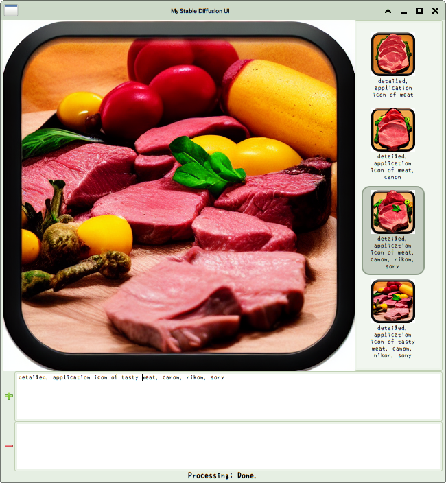

The GTK Stable Diffusion is a very simple text-to-image tool. The tool is based on [GTK](https://en.wikipedia.org/wiki/GTK) UI framework and [Diffusers](https://github.com/huggingface/diffusers)' [Stable Diffusion](https://en.wikipedia.org/wiki/Stable_Diffusion) text-to-image pipeline.

GTK Stable Diffusion aims just for fun. This means the tool is more focusing on ~~spell~~ prompt than many small adjustment and random generations.

Installation
============
We are now preparing its pip package. The setup.py is also under development.
<!--
```bash
pip install git+https://github.com/nazodane/gtk_stable_diffusion.git
```
```bash
pip install gtk_stable_diffusion
```
-->


Note that the model weights are automatically download via [BitTorrent magnet link](https://en.wikipedia.org/wiki/Magnet_URI_scheme) using [libtorrent](https://en.wikipedia.org/wiki/Libtorrent) and the model weights are automatically converted from original Stable Diffusion format to Diffusers format in the first launch of the tool.

Requirements
============
* Ubuntu 22.04 or later
* Python 3.10 or later
* CUDA 11.7 or later
* higher VRAM and DRAM

Recommendations
===============
* RTX 3060 12GB or higher
* DRAM 32GB
* Faster non-restricted internet connection

License
=======
GTK Stable Diffusion codes are under Apache License 2.0. This is because we almost depends on Diffusers.

GTK and [its Python bindings are LGPL](https://www.gtk.org/docs/language-bindings/python) so we should carefully treat GTK-related codes.

Screenshots
===========



